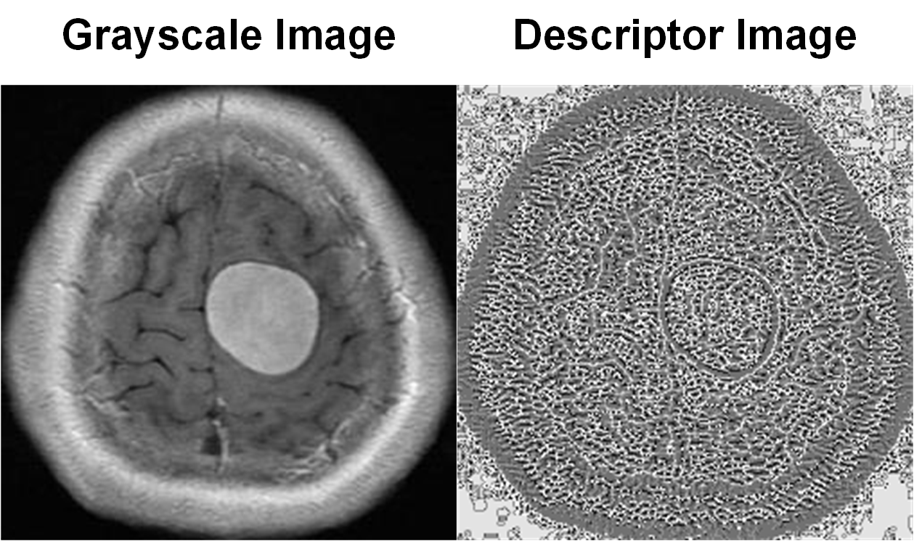

# lfepy

**Local Feature Extractors for Python** is a Python package for local descriptors. It provides feature extraction from grayscale images, facilitating AI tasks like object detection, facial recognition, and classification.

## Table of Contents

1. [Overview](#overview)
2. [Features](#features)
3. [Requirements](#Requirements)
4. [Installation](#installation)
5. [Documentation](#documentation)
6. [License](#license)
7. [Contact](#contact)

## Overview

**lfepy** is a Python package for local feature extraction. It contains 27 different descriptors that can be used for various tasks in computer vision and image processing.

## Features

- **Feature 1**: 27 different feature descriptors.
- **Feature 2**: Contains essential methods for feature extraction.
- **Feature 3**: Can be used for computer vision and image processing tasks.

## Requirements

- **python>=3.0**
- **numpy>=1.26.4**
- **scipy>=1.13.0**
- **scikit-image>=0.23.2**

## Installation

To install lfepy, use the following command:

```bash
pip install lfepy
```
## Usage
Basic Example
```python
# Import the required packages
import numpy as np
import matplotlib.pyplot as plt
from matplotlib.image import imread
from lfepy.Descriptor.LBP import LBP

# Read the image
image = imread(PATH)
# Extract feature using a specified descriptor
histogram, imgDesc = LBP(image, mode='nh', radius=1, mappingType='riu2')
# Show the descriptor
plt.imshow(imgDesc, cmap='gray')
plt.axis('off')
plt.show()
```

## Documentation
Comprehensive documentation for lfepy is available at [lfepydocs](documentation). It includes:

- **Getting Started**
- **API Reference**
- **Tutorials**

## License
lfepy is licensed under the MIT License. See the [LICENSE](LICENSE.md) file for more details.

## Contact
For any questions or support, please contact us at lfepy@gmail.com or visit our [GitHub](https://github.com/lfepy/lfepy) Issues page.
